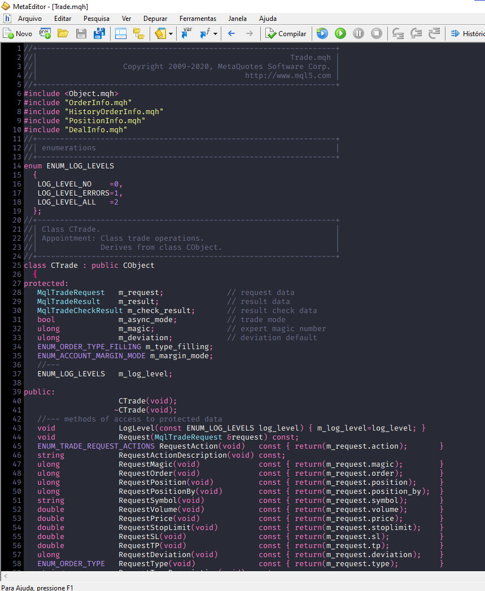

# Dracula for [MetaEditor](https://www.metatrader5.com/en/automated-trading/metaeditor)

> A dark theme for [MetaEditor](https://www.metatrader5.com/en/automated-trading/metaeditor).

## Install

All instructions can be found at [draculatheme.com/metaeditor](https://draculatheme.com/metaeditor).

## Team

This theme is maintained by the following person(s) and a bunch of [awesome contributors](https://github.com/dracula/metaeditor/graphs/contributors).

 |
--- |
[Abraão Moreira](https://github.com/AbraaoM) |

## License

[MIT License](./LICENSE)